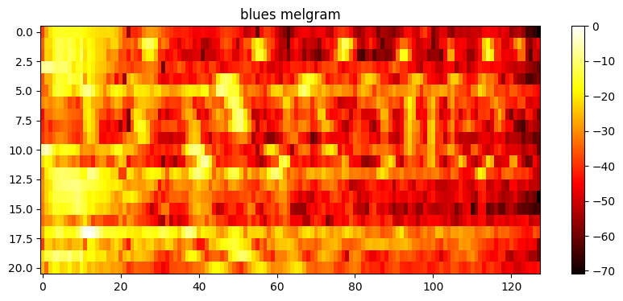
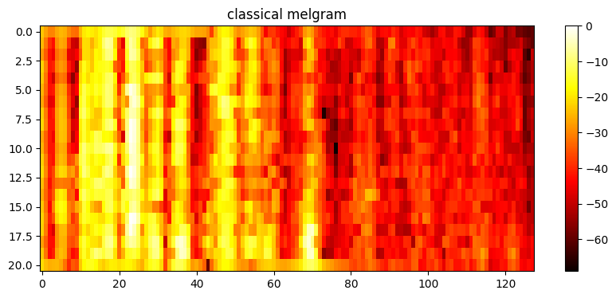
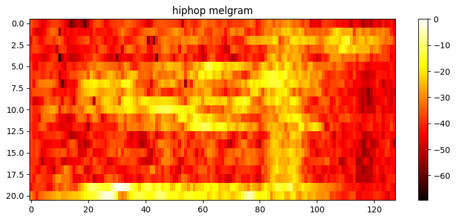
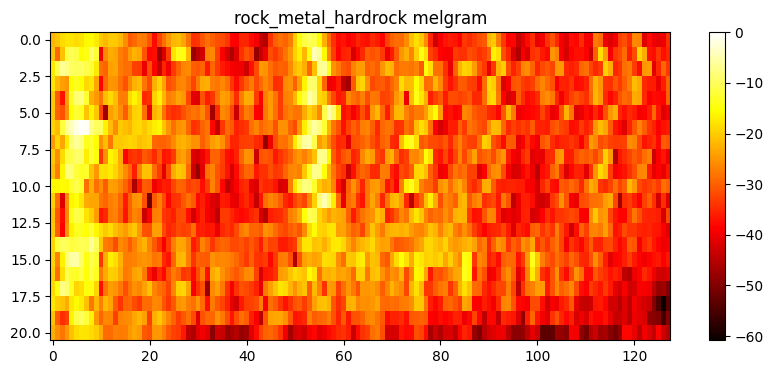

# Music Genre Classification with Neural Networks

Evangelia Steiropoulou

## Introduction

This project focuses on music genre classification using both fully connected and convolutional neural networks. The main objective is to classify 1-second music samples into four genres: classical, pop, rock, and blues. Two different audio data representations, MFCCs (Mel-frequency cepstral coefficients) and mel-spectrograms, are utilized.The code along with the detailed analysis can be found in the [music_classification.ipynb](https://github.com/EvangeliaS/Music-Classification-with-Neural-Networks/blob/c7312b91c3c6bd41fbf888a45c968a9cdb9a6f21/music_classification.ipynb) notebook.

## Table of Contents

- [Dataset](#dataset)
- [MFCCs](#mfccs)
  - [Fully Connected Neural Network](#fully-connected-neural-network)
  - [Performance evaluation](#performance-evaluation)
- [Mel-spectrograms](#mel-spectrograms)
  - [Convolutional Neural Network with Padding](#convolutional-neural-network-with-padding)
  - [Optimization Algorithms](#optimization-algorithms)
  - [Results](#results)

## Dataset

The [dataset](https://github.com/EvangeliaS/Music-Classification-with-Neural-Networks/tree/f47fc3f9401b257989bd223f3c7316f808a13d98/data/music_genre_data_di) used in this project is composed of audio samples from four different music genres: classical, pop, rock, and blues. It is divided into training, validation, and test sets, comprising 3200, 800, and 1376 samples, respectively. PyTorch is used to preprocess the data, build and train the neural network model.

## MFCCs

MFCCs (Mel-frequency cepstral coefficients) capture spectral characteristics transformed based on the mel scale, approximating human auditory perception. Each music sample generates a 26-dimensional feature vector by computing the mean and standard deviation for each of the 13 coefficients across 20 time frames.

### Fully Connected Neural Network

The fully connected neural network used in this project is designed with four layers, each specifying the number of neurons in that layer. The architecture of the neural network is as follows:

- Input Layer: 26 neurons
  - The input layer has 26 neurons, corresponding to the dimensionality of the input data.

- Hidden Layer 1: 128 neurons
  - The first hidden layer consists of 128 neurons, which apply a Rectified Linear Unit (ReLU) activation function.

- Hidden Layer 2: 32 neurons
  - The second hidden layer consists of 32 neurons, also utilizing the ReLU activation function.

- Output Layer: 4 neurons
  - The output layer contains 4 neurons, representing the number of classes for music genre classification.

The neural network takes 26-dimensional input data and passes it through these layers to make predictions for the music genre. It is trained using stochastic gradient descent (SGD) with a learning rate of 0.002 and the CrossEntropyLoss as the loss function. 

### Performance Evaluation

The model is trained on CPU and GPU, and the performance is evaluated.
Here are the results:

- **CPU Execution Time**: 9.05 seconds
- **GPU Execution Time**: 13.15 seconds

**Accuracy Comparison**

- **CPU Accuracy**: 62.14%
- **GPU Accuracy**: 56.40%

**F1-Score Comparison**

- **CPU F1-Score**: 0.611
- **GPU F1-Score**: 0.554

As observed, there is a trade-off between execution time and model performance when switching from CPU to GPU. While the GPU execution is slightly slower in this case, it's important to note that it offers a speed advantage for more complex models or larger datasets. Additionally, the CPU setup achieved a slightly higher accuracy and F1-score compared to the GPU. The choice between CPU and GPU may depend on the specific use case and hardware availability.

## Mel-spectrograms

Mel-spectrograms, provide a 21x128 matrix representing the time-frequency evolution of audio spectrum when applying the mel scale to the spectrogram.

    

## Convolutional Neural Network with Padding

We have implemented a Convolutional Neural Network (CNN) for music genre classification with added padding to the convolutional layers. Padding is set to 2, and max-pooling layers with a kernel size of 2 are included to downsample the feature maps.

  **Architecture**

Our CNN architecture consists of four convolutional layers followed by fully connected layers. Here's an overview of the architecture:

1. Convolutional Layer 1:
   - Input channels: 1 (for grayscale)
   - Output channels: 16
   - Kernel size: 5x5
   - Padding: 2
   - Activation function: ReLU
   - Max-pooling layer: Kernel size 2

2. Convolutional Layer 2:
   - Input channels: 16
   - Output channels: 32
   - Kernel size: 5x5
   - Padding: 2
   - Activation function: ReLU
   - Max-pooling layer: Kernel size 2

3. Convolutional Layer 3:
   - Input channels: 32
   - Output channels: 64
   - Kernel size: 5x5
   - Padding: 2
   - Activation function: ReLU
   - Max-pooling layer: Kernel size 2

4. Convolutional Layer 4:
   - Input channels: 64
   - Output channels: 128
   - Kernel size: 5x5
   - Padding: 2
   - Activation function: ReLU
   - Max-pooling layer: Kernel size 2

The output from the convolutional layers is then flattened and passed through a stack of fully connected layers:

- Fully Connected Layer 1: 1024 neurons with ReLU activation.
- Fully Connected Layer 2: 256 neurons with ReLU activation.
- Fully Connected Layer 3: 32 neurons with ReLU activation.
- Fully Connected Layer 4 (Output Layer): 4 neurons (corresponding to the number of classes) for classification.

  **Training**

We trained this CNN model using the SGD optimizer with a learning rate of 0.002 and the Cross-Entropy loss function. The model was trained on the GPU if available; otherwise, it used the CPU.

The addition of padding to the convolutional layers allows the network to better capture spatial information from the input spectrograms, potentially leading to improved performance in music genre classification tasks.

## Optimization Algorithms

Here are the results of our model's performance using various optimization algorithms:

  | Algorithm   | Accuracy  | F1 Score  |
  |-------------|-----------|-----------|
  | Adadelta    | 0.646076  | 0.646242  |
  | Adagrad     | 0.757994  | 0.756246  |
  | Adam        | 0.646802  | 0.656903  |
  | AdamW       | 0.692587  | 0.698515  |
  | Adamax      | 0.716570  | 0.724806  |
  | ASGD        | 0.696221  | 0.706873  |
  | NAdam       | 0.235465  | 0.095294  |
  | RAdam       | 0.694767  | 0.699481  |
  | RMSprop     | 0.646802  | 0.647611  |
  | Rprop       | 0.653343  | 0.657362  |
  | SGD         | 0.678779  | 0.685902  |

## Results

**Adagrad** and **Adamax** have the best accuracy and the best f1 score as well, as I noticed after several test runs. For this specific runtime, **Adagrad** has the best scores on both accuracy and f1-score.
